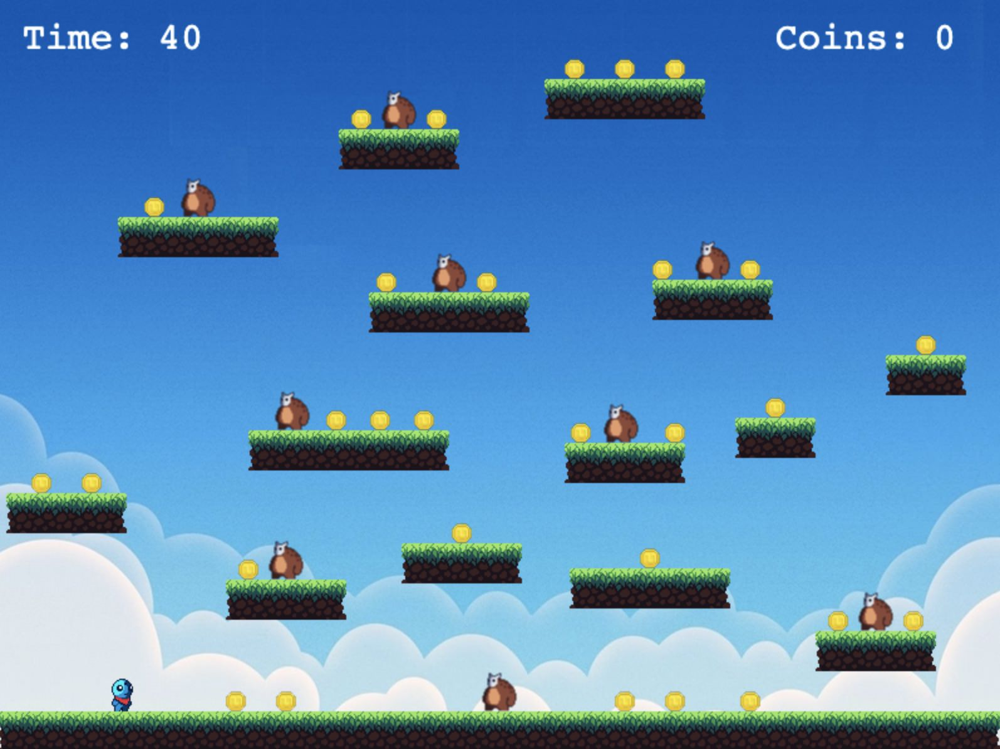

# Simple Phaser Game

This is a simple platform game made using [Phaser](https://phaser.io/), based on the the [Making Your First Game](https://phaser.io/tutorials/making-your-first-phaser-3-game/part1) tutorial on their website, with some modifications added and also different graphics from [Craftpix](https://craftpix.net) and others. The game runs in a web browser and written in JavaScript.

-------

## Running the game

`npm run start`

This is will start a web server on `localhost:8080`, where the game will run on a 800 x 600 pixel canvas.

## Aim of the game / how to play

Collect as many coins as you can before the time runs out.

If you die, or collect all the coins, **refresh the browser to start again**.

## Todo

- [ ] Make colliding space between the player and baddies tighter
- [ ] Create a screen when player dies
- [ ] Create a screen when player collects all coins within time limit
- [ ] Provide a way to start game again without browser refresh
- [ ] Create a start screen with instructions
- [ ] Create and use completely custom and unique graphics and srpites